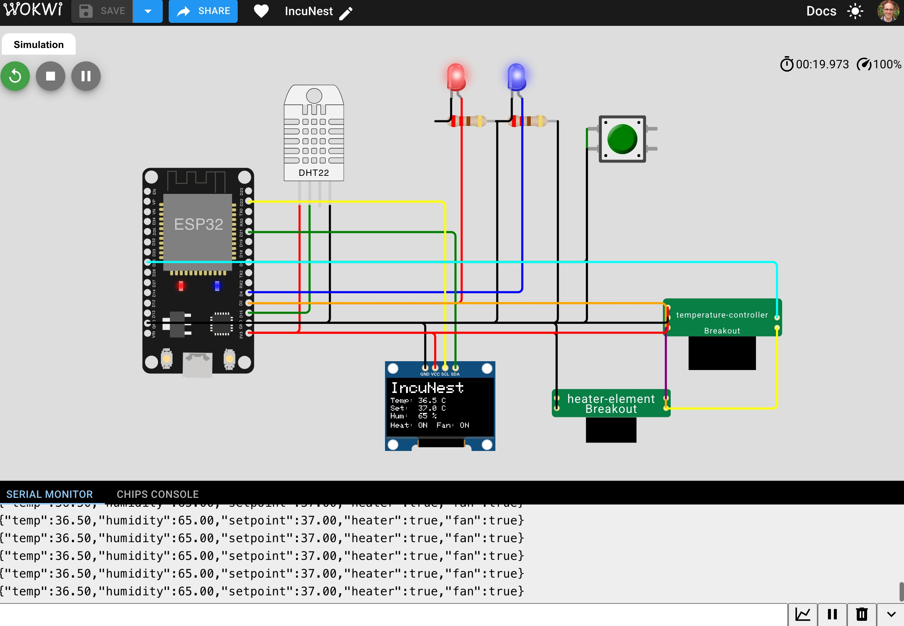

# IncuNest-Sim

🏥 **IncuNest Simulator for better contribution and development**

An interactive 3D visualization and hardware simulation platform for the IncuNest open-source neonatal incubator project.

## 🌟 Features

- **3D Visualization**: Interactive Three.js-based 3D model of the incubator
- **Hardware Simulation**: Full Wokwi-based ESP32 simulation with sensors and actuators
- **Custom Chips**: Custom Wokwi chips for specialized hardware components
- **MCP Integration**: Model Context Protocol server for AI-assisted development
- **CI/CD**: Automated testing and validation with GitHub Actions

## 🚀 Quick Start

### Prerequisites

- Node.js 18+ 
- npm or yarn

### Installation

```bash
# Clone the repository
git clone https://github.com/medicalopenworld/IncuNest-Sim.git
cd IncuNest-Sim

# Install dependencies
npm install

# Start development server
npm run dev
```

The application will be available at `http://localhost:5173`

### Building for Production

```bash
npm run build
npm run preview
```

## 📁 Project Structure

```
IncuNest-Sim/
├── src/                      # Source code
│   ├── main.js              # Three.js visualization
│   └── simulation.js        # Simulation engine
├── wokwi/                   # Wokwi hardware simulation
│   ├── diagram.json         # Circuit diagram
│   ├── sketch.ino          # ESP32 firmware
│   ├── platformio.ini      # PlatformIO config
│   └── chips/              # Custom Wokwi chips
│       ├── temperature-controller.chip.json
│       ├── temperature-controller.chip.c
│       ├── heater-element.chip.json
│       └── heater-element.chip.c
├── mcp/                     # Model Context Protocol
│   ├── mcp.json            # MCP configuration
│   └── server.js           # MCP server implementation
├── .github/
│   └── workflows/
│       └── wokwi-ci.yml    # CI/CD pipeline
├── index.html              # Main HTML file
├── package.json            # Node.js dependencies
└── README.md              # This file
```

## 🎮 Usage

### Interactive Controls

- **Mouse**: Rotate the 3D view (click and drag)
- **Scroll**: Zoom in/out
- **Buttons**:
  - `Open/Close Door`: Toggle the incubator door
  - `Toggle Heater`: Manually control the heater
  - `Reset Simulation`: Reset to initial state

### Sensor Data

The UI displays real-time data:
- **Internal Temperature**: Current temperature inside
- **Set Point**: Target temperature
- **Humidity**: Current humidity level
- **Heater Status**: ON/OFF
- **Fan Status**: ON/OFF

## 🔬 Wokwi Simulation

[](https://wokwi.com/projects/454508308570169345)

### Live Simulation

**[▶️ Run the simulation on Wokwi](https://wokwi.com/projects/454508308570169345)**



### Running Locally

1. Open the Wokwi simulator: [https://wokwi.com/projects/454508308570169345](https://wokwi.com/projects/454508308570169345)
2. Click "Start Simulation"
3. Observe the temperature control in action

### Hardware Components

- **ESP32 DevKit V1**: Main microcontroller
- **DHT22**: Temperature and humidity sensor
- **SSD1306 OLED**: Display screen
- **LEDs**: Heater and fan indicators
- **Push Button**: User input

### Custom Chips

#### Temperature Controller
- Implements PID control algorithm
- Maintains stable temperature
- Adjustable setpoint (30-40°C)

#### Heater Element
- Simulates thermal dynamics
- Realistic heating and cooling behavior
- Adjustable power (0-100W)

## 🤖 MCP Integration

The Model Context Protocol (MCP) server provides AI-assisted development capabilities.

### Available Tools

1. **get_simulation_state**: Get current simulation state
2. **set_temperature_setpoint**: Change target temperature
3. **control_heater**: Turn heater on/off
4. **control_fan**: Turn fan on/off
5. **get_sensor_history**: Retrieve historical data

### Running MCP Server

```bash
npm run mcp
```

### Configuration

Add to your MCP client configuration:

```json
{
  "mcpServers": {
    "incunest-sim": {
      "command": "node",
      "args": ["mcp/server.js"]
    }
  }
}
```

## 🧪 Testing

### Automated Tests

CI/CD pipeline automatically validates:
- JSON configuration files
- Wokwi diagram structure
- Custom chip definitions
- Build process

### Running Locally

```bash
# Validate Wokwi configuration
python3 -m json.tool wokwi/diagram.json

# Validate custom chips
python3 -m json.tool wokwi/chips/*.chip.json
```

## 🛠️ Development

### Adding Custom Chips

1. Create `<chipname>.chip.json` in `wokwi/chips/`
2. Create `<chipname>.chip.c` with implementation
3. Follow [Wokwi Chips API documentation](https://docs.wokwi.com/chips-api/getting-started)

### Modifying 3D Model

Edit `src/main.js` to customize the 3D visualization:
- Geometry and materials
- Lighting and shadows
- Animations and interactions

### Simulation Parameters

Adjust PID parameters in `src/simulation.js`:
```javascript
this.kp = 0.5; // Proportional gain
this.ki = 0.01; // Integral gain
this.kd = 0.1; // Derivative gain
```

## 📚 Related Projects

- **IncuNest**: [github.com/medicalopenworld/IncuNest](https://github.com/medicalopenworld/IncuNest)
- **IncuNest-Docs**: [github.com/medicalopenworld/IncuNest-Docs](https://github.com/medicalopenworld/IncuNest-Docs)

## 🤝 Contributing

Contributions are welcome! Please:

1. Fork the repository
2. Create a feature branch
3. Make your changes
4. Submit a pull request

## 📄 License

This project follows the same license as IncuNest.  
See [LICENSE](LICENSE) for details.

## 🌍 About Medical Open World

Medical Open World is an NGO dedicated to reducing neonatal mortality worldwide by providing accessible, reliable, and locally replicable medical devices.

**Website**: [medicalopenworld.org](https://medicalopenworld.org)  
**Contact**: contact@medicalopenworld.org  
**Instagram**: [@medicalopenworld](https://www.instagram.com/medicalopenworld)

---

> _"So that the place where a premature baby is born does not limit their chances of survival."_

